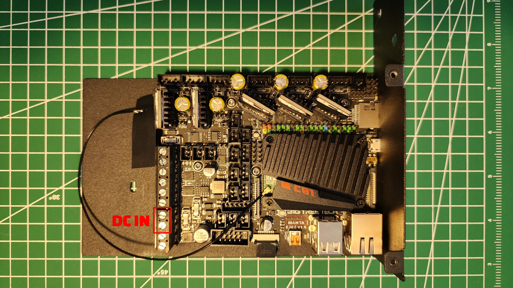
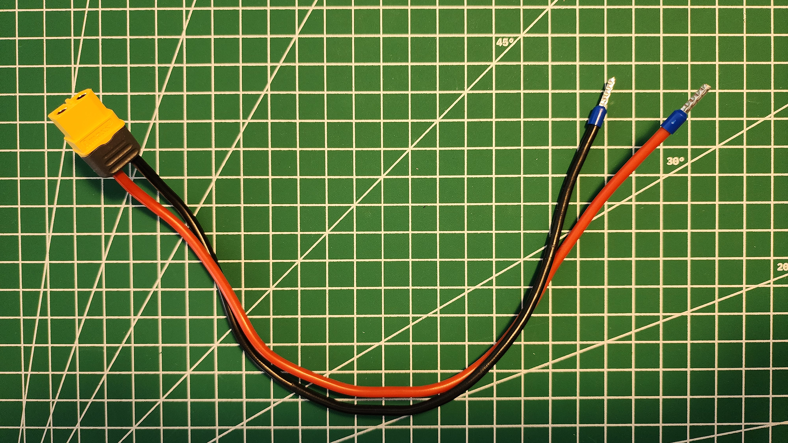
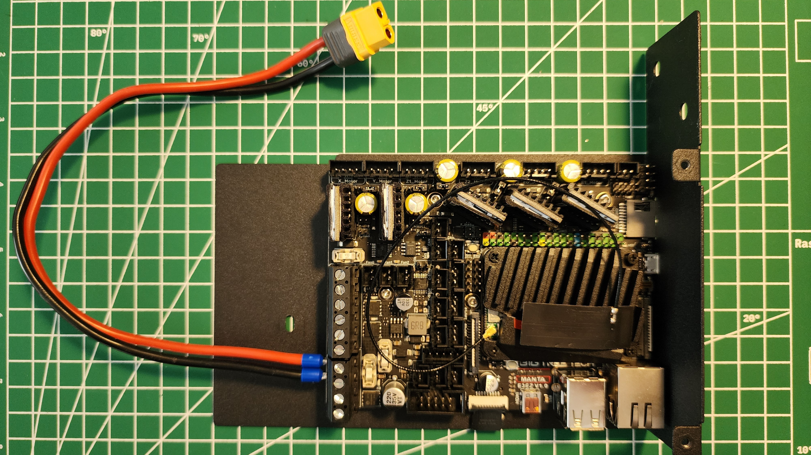
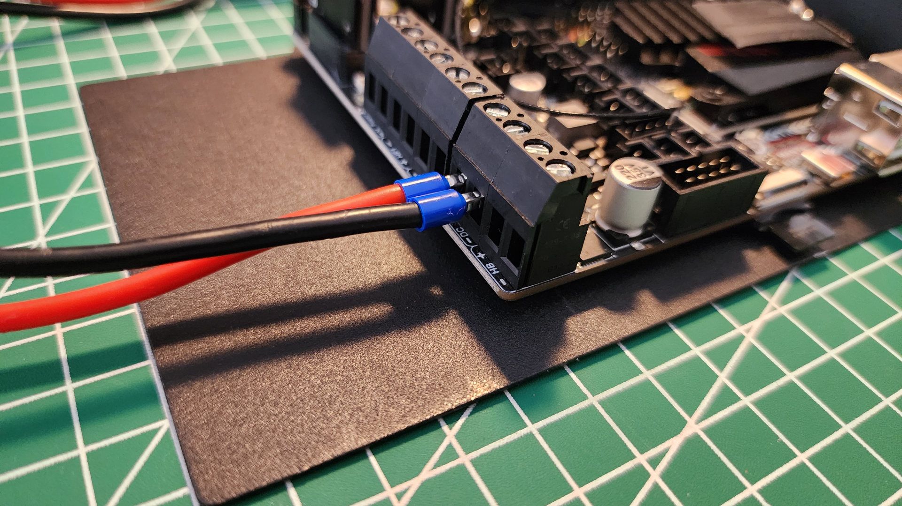
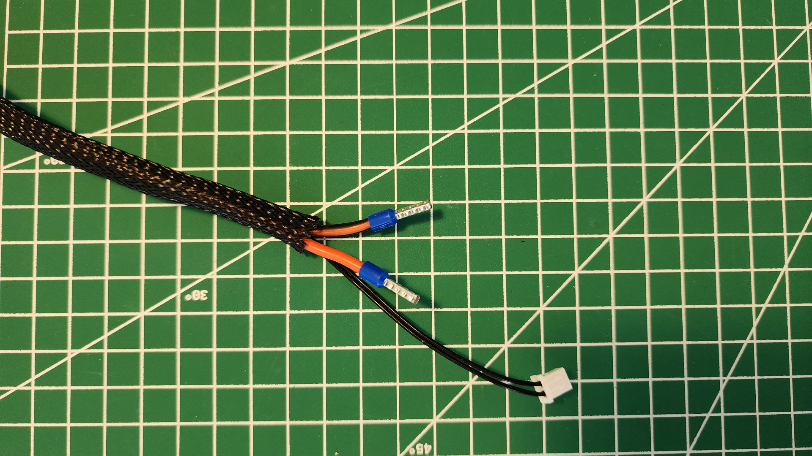
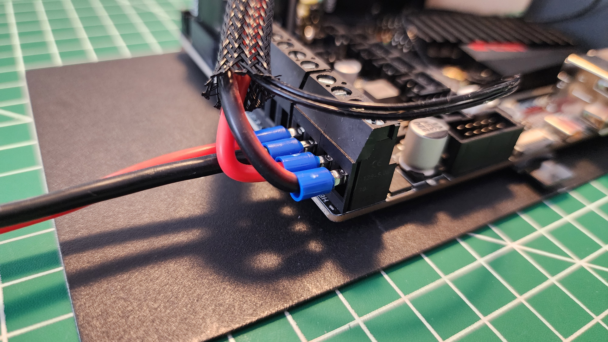
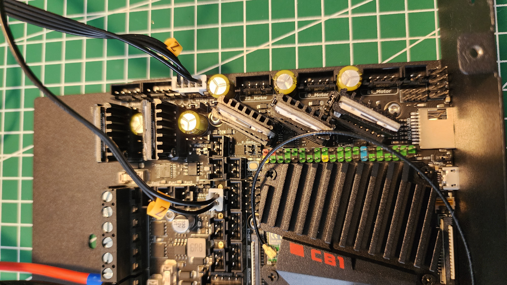
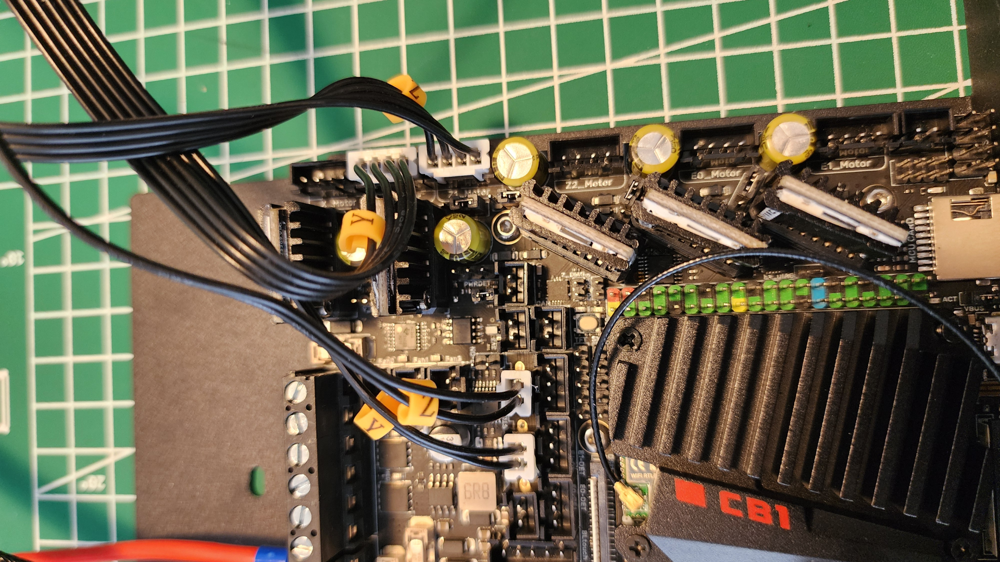
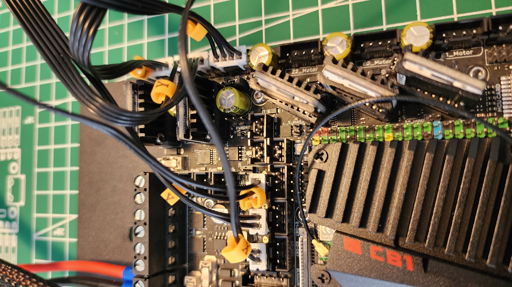
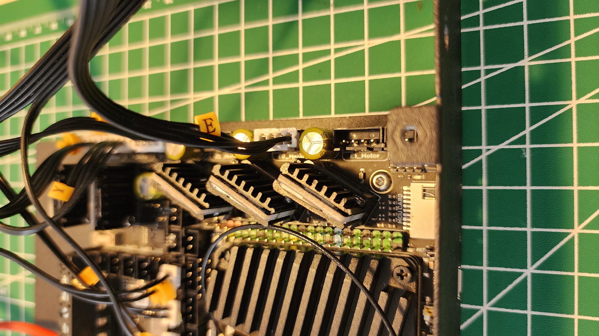

# E3EZ Cable Connections
## The Power Cable
While setting up the Hermit Crab V2.0 CAN Bus, we used a USB cable to power the E3EZ board.\
Now, it is time to make the power connection using a female XT60 connector.\

Cut the wire ends of the XT60 connector.\
You can cut, twist, and solder them, or use a crimping tool to crimp ferrules onto the wire ends.\
I used [Someline’s Ferrule Crimping Toolkit](https://a.co/d/6WrWCFI "SOMELINE Ferrule Crimping Tool") for this process and a 2.5 mm^2 10 mm wire ferrule.\

Connect the wire ends to the DC ports of the E3EZ board.\
⚠️Be careful with the cable polarity.\

## The Heated Bed Cable
Cut the wire ends of the heated bed cable of the Ender 3 Pro.\
You can cut, twist, and solder them, or use a crimping tool to crimp ferrules onto the wire ends.\
I used [Someline’s Ferrule Crimping Toolkit](https://a.co/d/6WrWCFI "SOMELINE Ferrule Crimping Tool") for this process and a 2.5 mm^2 10 mm wire ferrule.\

Connect the wire ends to the HB ports of the E3EZ board and make the onboard cable connection.\

## The Axis and Extruder Cables
Now, you can connect the axis cables to the E3EZ board.

Connect the Z-axis cable to the Z1 Motor and Z-Stop slots.\

Connect the Y-axis cable to the Y1 Motor and Y-Stop slots.\

Connect the X-axis cable to the X1 Motor and X-Stop slots.\

Finally, connect the extruder cable to the E0 Motor slot.\

Now, you are ready to power your E3EZ.
