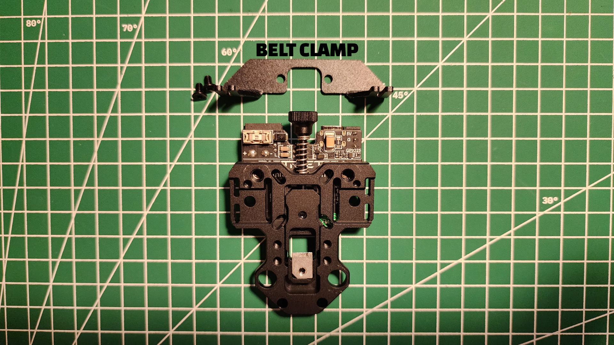
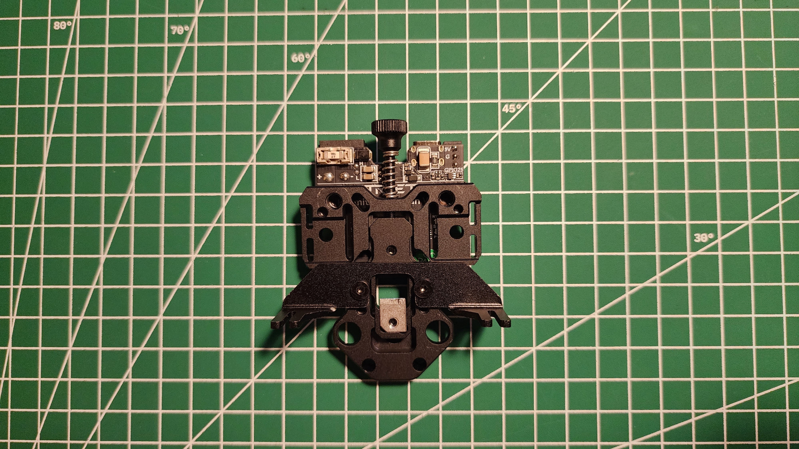
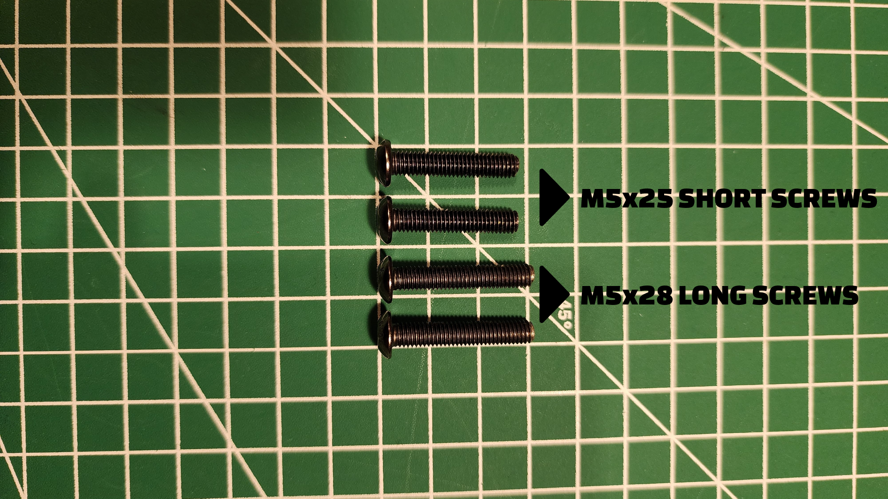
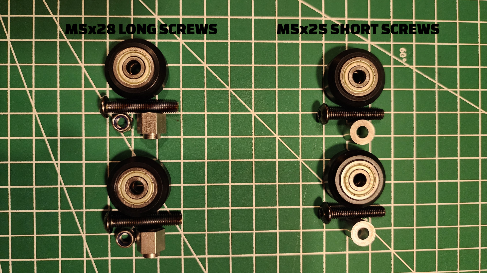
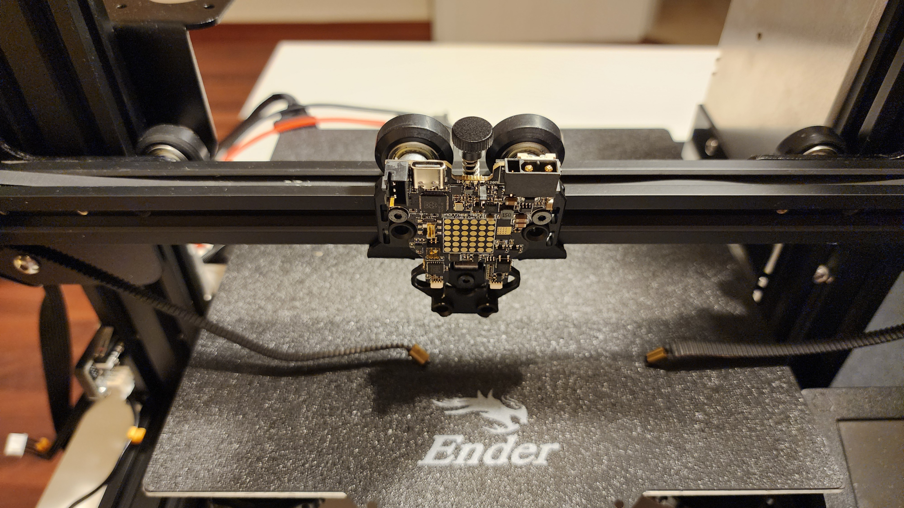
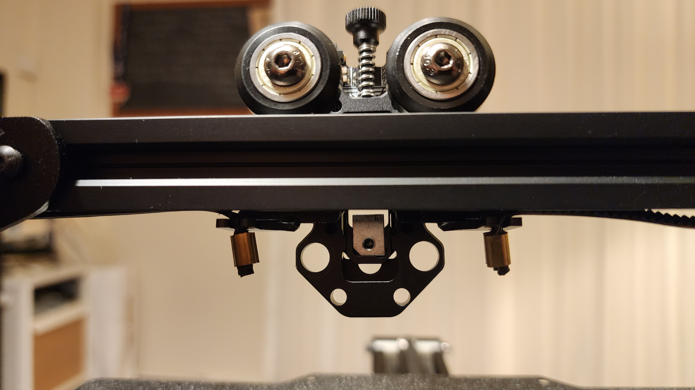
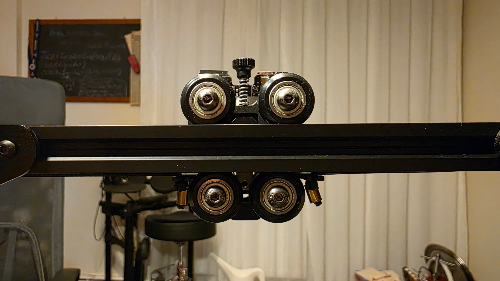
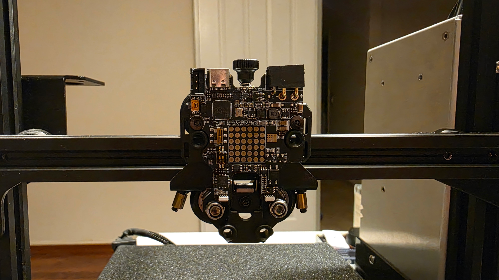

# Hermit Crab V2.0 to Ender 3 Pro Assembly
## Assenbling the Belt Clamp
Hermit Crab V2.0 has a belt clamp for installing the POM wheel on the Ender 3 Pro.\

Assemble the clamp to the fixed plate of the Hermit Crab V2.0 using two M3x5 flat-head countersunk screws.\

## Assenbling the POM Wheels

Hermit Crab V2.0 has four POM wheels to assemble on Ender 3 Pro.

⚠️Be Careful! The M5 button-head cap screws used to assemble POM wheels are different sizes.\
Two of them are M5x28, and two of them are M5x25.\

If you assemble them incorrectly, you may damage the Hermit Crab V2.0's fixed plate.\

Use eccentric spacers and self-locking nuts with the M5x28 button-head cap screws, and spacers with the M5x25 button-head cap screws.

First, assemble the M5x25 button-head cap screws and spacers at the top of the Hermit Crab V2.0 fixed plate. Place the assembled part onto the V-slot rail of Ender 3 Pro.\
Since all wheels will need an adjustment in the end, do not tighten the screws too much.\

Connect the x-axis belt of Ender 3 Pro to the fixed plate.\

Assemble the M5x28 button-head cap screws and the eccentric spacers at the bottom of the fixed plate. Do not tighten the screws too much.\

Now, you can tighten the screws of the POM wheels so that the fixed plate can move along the x-axis without any problem.
